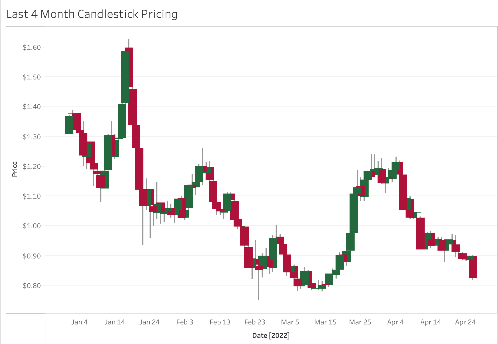
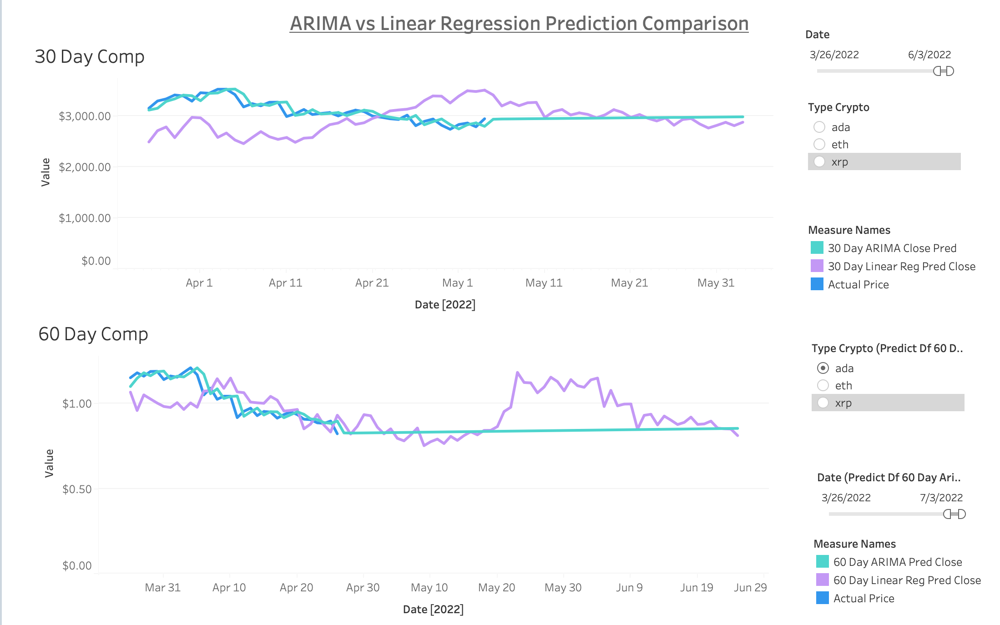

# Crypto-Predictor-Model

Google Slides Presentation:

https://docs.google.com/presentation/d/1osnXG7ekbSfd0CvpOe8LRtvBTFQdVWlRWibVyDO1Dwg/edit#slide=id.g129b6a2aaa7_0_107

Link to Tableau Public: https://public.tableau.com/app/profile/teddy.accardi/viz/CryptoPredictionModel

### Selected Topic: Cryptocurrency Predictor Model
We have selected our topic to be within the cryptocurrency space. We wanted to explore this area and decided to build a supervised learning model to take in historical pricing data and predict what the price of a given cryptocurrency will be at various points in the future. Multiple of our team members are interested in crypto and we decided to take our interests and take on a project that will be both fun and challenging as we look forward into the job hunt and life after the bootcamp. 

### Source Material
We procured our daily historical pricing from a crypto tracking site (coincodex.com) in a csv file for Cardano (ADA), Ethereum (ETH) and Ripple (XRP). We gathered daily pricing data for the day's open, close, high, low, trading volume and market cap as our features for the machine learning model. We have data going back several years to provide enough info for as highly predictive of a model as we can.

### Open Questions
Some questions we hope to answer are:
- What will our model predict that the price of Cardano, Ethereum and Ripple will be at various points in the future? Is supervised learning the best option to tell us this?
- Can we apply the same model to other cryptocurrencies? We have provided a subset of Ethereum, Cardano and Ripple
- Will different cryptos with their different price volumes and differing real world utility behave similarly?

We created GitHub branches for each part of our project: the presentation/project overview, machine learning model, the database and the dashboard. Each member will be owning a particular piece of it to ensure it is up to date through each segment of the final project, but we will all be contributing to each part.  

### Analysis Phase
After sourcing the historical pricing data for each of the three cryptocurrencies, we decided to use a linear regression supervised learning model to train our historical data on our features and predict what the daily closing price of each cryptocurrency will be for the next 30 and 60 days. We then connected this data to store in a Postgres database via AWS RDS and extracted it from Postgres to visualize in Tableau. Within these visualizations we allow the user to filter between our 30 and 60 day predictive models, as well as choose which cryptocurrency they would like displayed amongst the three for both the predictions, as well as the historical models, adding an interactive element to our charts.

### Historical Data

Note: The variety in sizing of the daily candlesticks illustrated in this chart show how the prices of cryptocurrencies not only day to day, but throughout the course of the day as well. The length of each candlestick, and their accompanying grey tracking line behind, correspond to the spreads between open and close, as well as high and low. These are the extra features that we feed into the linear regression models, but not the ARIMA models, which only take the closing price, and give us increased confidence in the linear regression model as a result.

Note: From the figures above, we see that these three cryptos have a herd mentality and closely follow each other in spikes and troughs. Interstingly, cryptos picked up during the pandemic years and if one looks beyond the covers it was when disposable income in the form of stimulus checks were handed out at a time when individuals were stuck at home and not having the same avenues to spend that disposable income elsewhere like they had in the past. Volume increase is accompanied almost instantaneously by a price spike, higher or lower. Volume is an important input feature because of its immediate handshake with price.

### Prediction Models 

We see a slight shift in the chart from the actual price to the 30 and 60 day linear regression models. This is due to the data being trained to forecast 30 and 60 days into the future and since we use previous data to predict future data, historical pricing isn't introduced into the model for 30 or 60 days, respectively, causing similar chart movement on a slight delay.

Since the ARIMA method is forecasting out to a certain point, it takes a linear path to get to the desired 30 and 60 day price. Interestingly, despite the very different paths the linear regression and ARIMA models take to the 30 and 60 predicted prices, they both predict similar prices 30 and 60 days into the future (ending points of the above chart).

Note:

### Summary

Data Teams analysis and inference:
Linear regression outputs were different from the ARIMA model. From a structure standpoint the ARIMA model used two features (original date and the close price). Whereas the linear regression mode used open, high, close, volume and marketcap.
We recommend using the linear regression because the number of inputs. 

Extending the model:
Provide an input scheme to include cryptos as required via a file uplaod. Currently it is restricted to 3 cryptos
Include latest novel techniques and features such as market sentiment and other statitical attributes used by the stok market analysts.
Lastly, we encourage developer input to further hone this model. Perhaps bring in additional features such as market sentiment, or even factors like calamities and wars the impact they have on the crypto market and individual prices.

NB: Every model has its pros and cons and any users of this model should understand its risks and thoroughly investigate the logic prior to investing.

Answering our initial questions:

- What will our model predict that the price of Cardano, Ethereum and Ripple will be at various points in the future? Is supervised learning the best option to tell us this?

Findings: 

**30 Day Linear Regression:** ADA: $0.82  ETH: $2,815.23  XRP: $0.64

**30 Day ARIMA:** ADA: $0.84  ETH: $2,969.46  XRP: $0.64

**60 Day Linear Regression:** ADA: $0.81  ETH: $2,838.94  XRP: $0.64

**60 Day ARIMA:** ADA: $0.85  ETH: $3,016.93  XRP: $0.65

- Can we apply the same model to other cryptocurrencies? We have provided a subset of Ethereum, Cardano and Ripple

Findings: Yes. Because the features of our model are metrics that are universally available for any cryptocurrency, it is easily replicable for any crypto, as we showed by performing the analysis on three separate ones.

- Will different cryptos with their different price volumes and differing real world utility behave similarly?

Findings: Yes. Ethereum and Cardano have far different volumes and market caps, but both behave similarly when plotted on a chart, pointing to a "herd mentality" across the crypto space, or at least amongst those we modeled. 
