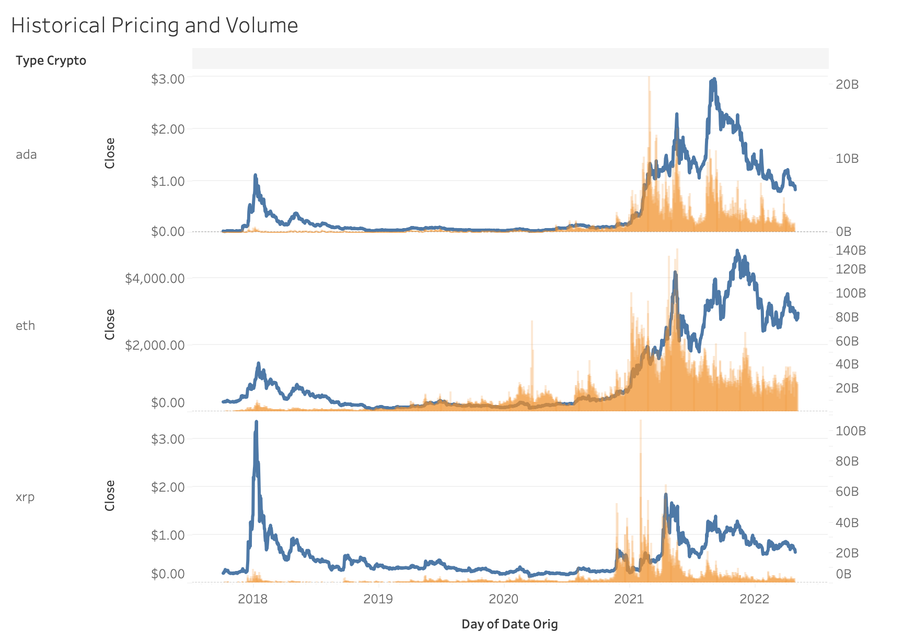

# Crypto-Predictor-Model

Google Slides Presentation:

https://docs.google.com/presentation/d/1osnXG7ekbSfd0CvpOe8LRtvBTFQdVWlRWibVyDO1Dwg/edit#slide=id.g129b6a2aaa7_0_107

Link to Tableau Public: https://public.tableau.com/app/profile/teddy.accardi/viz/CryptoPredictionModel

### Selected Topic: Cryptocurrency Predictor Model
We have selected our topic to be within the cryptocurrency space. We wanted to explore this area and decided to build a supervised learning model to take in historical pricing data and predict what the price of a given cryptocurrency will be at various points in the future. Multiple of our team members are interested in crypto and we decided to take our interests and take on a project that will be both fun and challenging as we look forward into the job hunt and life after the bootcamp. 

### Source Material
We procured our daily historical pricing from a crypto tracking site (coincodex.com) in a csv file for Cardano (ADA), Ethereum (ETH) and Ripple (XRP). We gathered daily pricing data for the day's open, close, high, low, trading volume and market cap as our features for the machine learning model. We have data going back several years to provide enough info for as highly predictive of a model as we can.

### Open Questions
Some questions we hope to answer are:
- What will our model predict that the price of Cardano will be at various points in the future?
- Is supervised learning the best option to tell us this?
- Can we apply the same model to other cryptocurrencies?
- Will other categories of crypto behave similarly? 

We created GitHub branches for each part of our project: the presentation/project overview, machine learning model, the database and the dashboard. Each member will be owning a particular piece of it to ensure it is up to date through each segment of the final project, but we will all be contributing to each part.  

### Analysis Phase
After sourcing the historical pricing data for each of the three cryptocurrencies, we decided to use a linear regression supervised learning model to train our historical data on our features and predict what the daily closing price of each cryptocurrency will be for the next 30 and 60 days. We then connected this data to store in a Postgres database via AWS RDS and extracted it from Postgres to visualize in Tableau. Within these visualizations we allow the user to filter between our 30 and 60 day predictive models, as well as choose which cryptocurrency they would like displayed amongst the three for both the predictions, as well as the historical models, adding an interactive element to our charts.

### Historical Data

### Prediction Models

